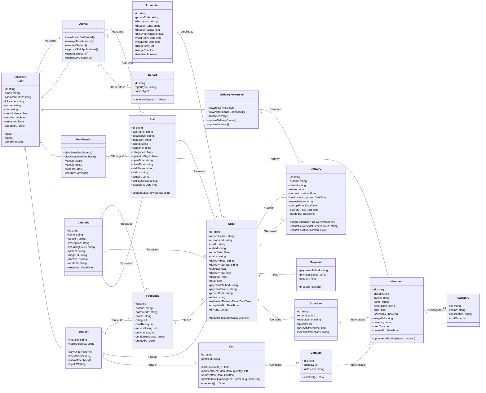

```mermaid
classDiagram

    direction LR

    class User {
        <<abstract>>
        +id: string
        +email: string
        +passwordHash: string
        +fullName: string
        +phone: string
        +role: string
        +creditBalance: float
        +isActive: boolean
        +createdAt: Date
        +updatedAt: Date
        +login()
        +logout()
        +updateProfile()
    }

    class Student {
        +matricId: string
        +hostelAddress: string
        +viewOrderHistory()
        +trackOrderStatus()
        +submitFeedback()
        +topUpWallet()
    }

    class FoodVendor {
        +viewSalesDashboard()
        +viewCustomerFeedback()
        +manageStall()
        +manageMenu()
        +processOrders()
        +withdrawEarnings()
    }

    class DeliveryPersonnel {
        +viewDeliveryHistory()
        +viewPerformanceDashboard()
        +acceptDelivery()
        +updateDeliveryStatus()
        +updateLocation()
    }

    class Admin {
        +viewAdminDashboard()
        +manageUserAccount()
        +overseeSystem()
        +approveStallApplications()
        +generateReports()
        +managePromotions()
    }

    class Cart {
        +id: string
        +profileId: string
        +calculateTotal(): float
        +addItem(item: MenuItem, quantity: int)
        +removeItem(item: CartItem)
        +updateItemQuantity(item: CartItem, quantity: int)
        +checkout(): Order
    }

    class CartItem {
        +id: string
        +quantity: int
        +instruction: string
        +subTotal(): float
    }

    class Order {
        +id: string
        +orderNumber: string
        +customerId: string
        +stallId: string
        +cafeId: string
        +orderDate: Date
        +status: string
        +deliveryType: string
        +deliveryAddress: string
        +subtotal: float
        +deliveryFee: float
        +discount: float
        +total: float
        +paymentMethod: string
        +paymentStatus: string
        +promoCode: string
        +notes: string
        +estimatedDeliveryTime: DateTime
        +completedAt: DateTime
        +driverId: string
        +updateStatus(newStatus: string)
    }

    class OrderItem {
        +id: string
        +orderId: string
        +menuItemId: string
        +quantity: int
        +priceAtOrderTime: float
        +specialInstructions: string
    }

    class Payment {
        +paymentMethod: string
        +paymentStatus: string
        +amount: float
        +processPayment()
    }

    class Delivery {
        +id: string
        +orderId: string
        +riderId: string
        +status: string
        +currentLocation: Point
        +lastLocationUpdate: DateTime
        +statusHistory: Array
        +pickupTime: DateTime
        +deliveryTime: DateTime
        +createdAt: DateTime
        +assignRider(rider: DeliveryPersonnel)
        +updateDeliveryStatus(newStatus: string)
        +updateLocation(location: Point)
    }

    class Cafeteria {
        +id: string
        +name: string
        +location: string
        +description: string
        +operatingHours: string
        +contact: string
        +imageUrl: string
        +isActive: boolean
        +vendorId: string
        +createdAt: DateTime
    }

    class Stall {
        +id: string
        +stallName: string
        +description: string
        +imageUrl: string
        +cafeId: string
        +vendorId: string
        +categories: Array
        +operationDays: Array
        +openTime: string
        +closeTime: string
        +stallStatus: string
        +status: string
        +contact: string
        +availablePayout: float
        +createdAt: DateTime
        +updateStatus(newStatus: string)
    }

    class MenuItem {
        +id: string
        +stallId: string
        +cafeId: string
        +name: string
        +description: string
        +price: float
        +isAvailable: boolean
        +imageUrl: string
        +category: string
        +prepTime: int
        +createdAt: DateTime
        +updateAvailability(status: boolean)
    }

    class Category {
        +id: string
        +name: string
        +description: string
        +sortOrder: int
    }

    class Feedback {
        +id: string
        +orderId: string
        +customerId: string
        +cafeId: string
        +rating: int
        +foodRating: int
        +serviceRating: int
        +comment: string
        +vendorResponse: string
        +createdAt: Date
    }

    class Promotion {
        +id: string
        +promoCode: string
        +description: string
        +discountType: string
        +discountValue: float
        +minOrderAmount: float
        +validFrom: DateTime
        +validUntil: DateTime
        +usageLimit: int
        +usageCount: int
        +isActive: boolean
    }

    class Report {
        +id: string
        +reportType: string
        +data: object
        +generateReport(): Report
    }

    %% Relationships

    %% User Inheritance
    User <|-- Student
    User <|-- FoodVendor
    User <|-- DeliveryPersonnel
    User <|-- Admin

    %% Student and Cart/Order
    Student "1" -- "1" Cart : "Has a"
    Student "1" -- "0..*" Order : "Places"
    Student "1" -- "0..*" Feedback : "Submits"

    Cart "1" o-- "1..*" CartItem : "Contains"
    CartItem "1" -- "1" MenuItem : "References"

    %% Order Lifecycle
    Order "1" o-- "1..*" OrderItem : "Contains"
    OrderItem "1" -- "1" MenuItem : "References"
    Order "1" -- "1" Payment : "Has"
    Order "1" -- "0..1" Delivery : "Requires"

    %% Vendor and Stall/Menu/Order
    FoodVendor "1" -- "1..*" Stall : "Manages"
    Cafeteria "1" -- "1..*" Stall : "Contains"
    Stall "1" -- "1..*" MenuItem : "Offers"
    Stall "1" -- "0..*" Order : "Receives"
    Cafeteria "1" -- "0..*" Order : "Receives"
    Cafeteria "1" -- "0..*" Feedback : "Receives"

    %% Delivery
    DeliveryPersonnel "1" -- "0..*" Delivery : "Handles"
    Delivery "1" -- "1" Order : "Tracks"

    %% Admin
    Admin "1" -- "0..*" User : "Manages"
    Admin "1" -- "0..*" Report : "Generates"
    Admin "1" -- "0..*" Promotion : "Manages"
    Admin "1" -- "0..*" Stall : "Approves"

    %% System / Others
    Feedback "1" -- "1" Order : "Is for"
    Promotion "0..*" -- "0..*" Order : "Applies to"
    MenuItem "1" -- "0..1" Category : "Belongs to"
```

